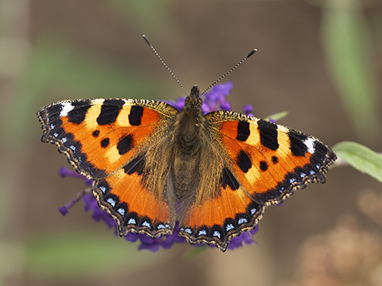

# CL Glitcher
| Original image                                           | CL Glitched image                                                                    |
|----------------------------------------------------------|--------------------------------------------------------------------------------------|
|  |  |

## Installation
### Clone and submodules
First, run the following commands to clone the repository and all submodules. These submodules are built using this repository's CMake files.
```shell script
git clone https://github.com/bridgerrholt/cl_glitcher
cd cl_glitcher
git submodule init
git submodule update
```

### OpenCL
For GPU processing, this project uses OpenCL. You must install your GPU manufacturer's GPU computation toolkit. Then, in the CMake GUI set `OPENCL_INCLUDE_DIR` to the `include` directory of the toolkit. The library file itself should be found by CMake. If not, try setting `OPENCL_LIB_DIR` to the `bin` or `lib` directory of the toolkit.

### OpenCV
Now, OpenCV is required and is not integrated into our CMake files. So, download it yourself (it's available on most package managers). Then, in the CMake GUI set `OPENCV_LIB_DIR` to the `lib` directory of your OpenCV installation and `OPENCV_INCLUDE_DIR` to the `include/opencv4` directory.

### Dynalo
You may have to run
```shell script
cd vendor
cd dynalo
git pull origin master
```

### CLI11
To use the CLI functionality, you must download [CLI11](https://github.com/CLIUtils/CLI11) and set the CMake variable `CLI11_INCLUDE_DIR` to the `include` directory of CLI11.